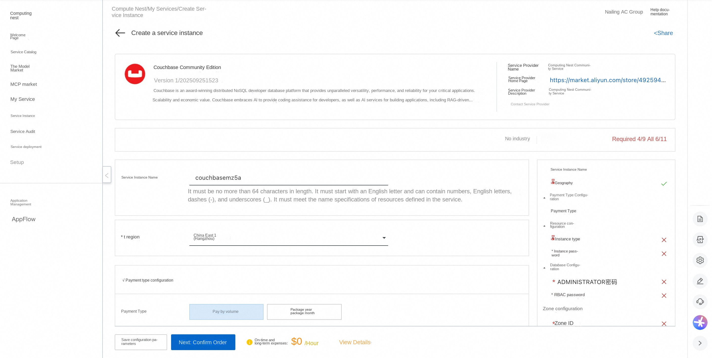
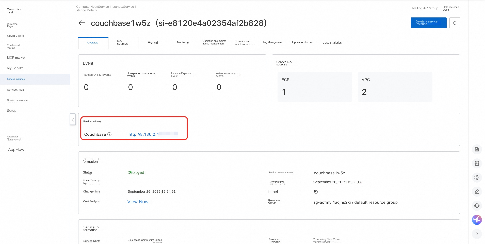

##🌟Service Introduction

Couchbase is an award-winning distributed NoSQL developer database platform that delivers unmatched versatility, performance, scalability and economic value for your mission-critical applications. Couchbase embrace AI, providing coding assistance for developers, and AI services for building applications, including RAG-powered agents, real-time analytics, and cloud-to-edge vector search.

##💰Billing Description

The cost of Couchbase Community Edition deployment in Computing Nest mainly involves:

-Selected vCPU and memory specifications
-System disk type and capacity
-public network bandwidth

##🚀Deployment Process

1. Visit the Computing Nest Couchbase Community Edition [Deployment Link](https://computenest.console.aliyun.com/service/instance/create/cn-hangzhou?type=user&ServiceId=service-c3f862ce09a04a24a115) and fill in the deployment parameters as prompted:

2. After completing the parameters, you can see the corresponding RFQ details. After confirming the parameters, click **Next: Confirm Order**.

3. Confirm that the order is complete and agree to the service agreement and click **Create Now** to enter the deployment phase.

4. Wait for the deployment to complete and enter the service instance details page.

5. Click on the service address and use the Couchbase Community Edition.

#📚Guidelines for use

For more use, please refer to the Couchbase [official website document](https://docs.couchbase.com/home/index.html).