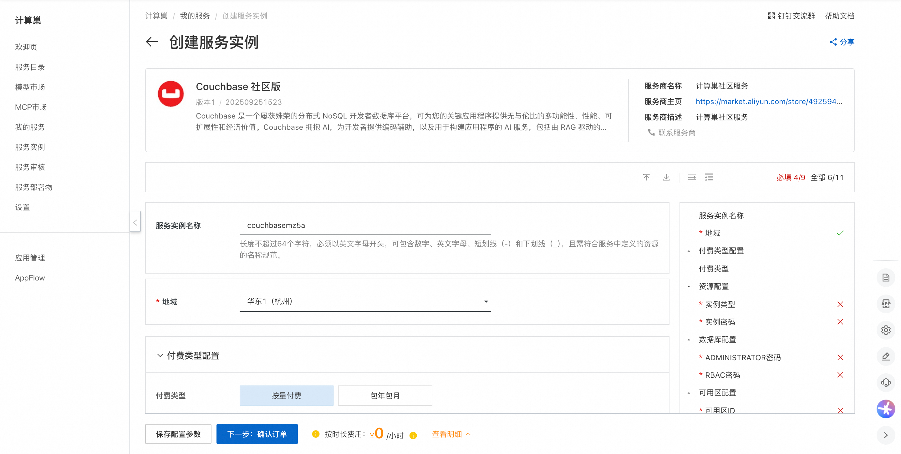
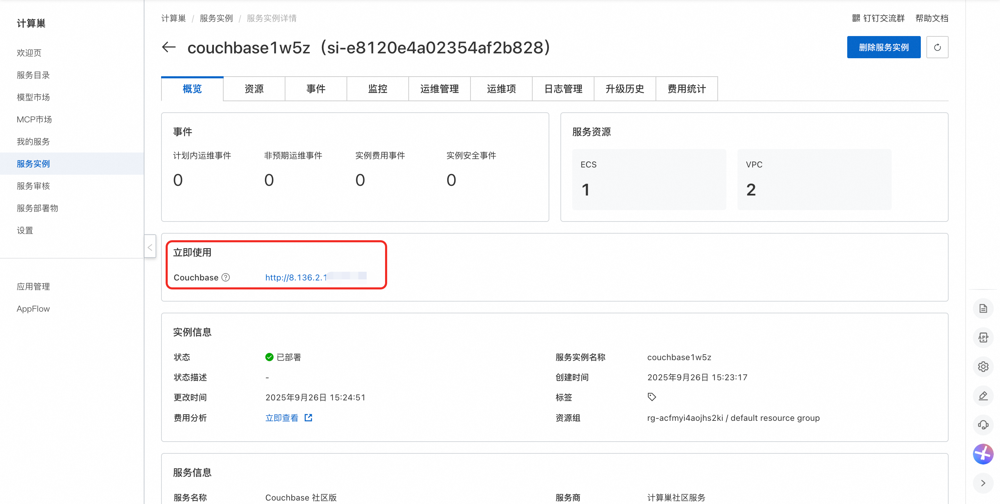
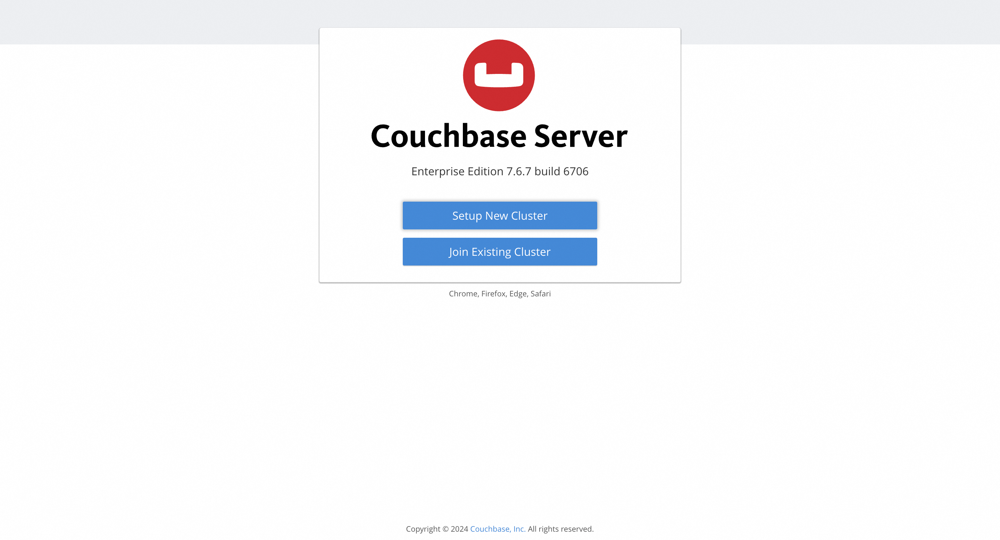

## 🌟 服务简介

Couchbase 是一个屡获殊荣的分布式 NoSQL 开发者数据库平台，可为您的关键应用程序提供无与伦比的多功能性、性能、可扩展性和经济价值。Couchbase 拥抱 AI，为开发者提供编码辅助，以及用于构建应用程序的 AI 服务，包括由 RAG 驱动的代理、实时分析和云到边缘的矢量搜索。

## 💰 计费说明

Couchbase社区版在计算巢部署的费用主要涉及：

- 所选vCPU与内存规格
- 系统盘类型及容量
- 公网带宽

## 🚀 部署流程

1. 访问计算巢Couchbase社区版[部署链接](https://computenest.console.aliyun.com/service/instance/create/cn-hangzhou?type=user&ServiceId=service-c3f862ce09a04a24a115)，按提示填写部署参数：
   

2. 参数填写完成后可以看到对应询价明细，确认参数后点击**下一步：确认订单**。

3. 确认订单完成后同意服务协议并点击**立即创建**进入部署阶段。

4. 等待部署完成后进入服务实例详情页。
   

5. 点击服务地址并使用Couchbase社区版。
   

# 📚 使用指南

更多用法请参考Couchbase[官网文档](https://docs.couchbase.com/home/index.html)。